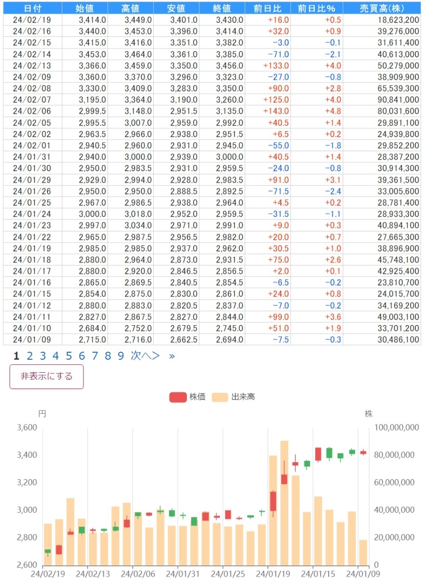

# KABUTAN-Visualizer
Visualize KABUTAN's finance report as bar and line graphs.

## Preview

| 【通期】業績推移 | 【通期】成長性 |
| --------------- | ------------- |
|  |  |
| 【通期】収益性 | 上期/下期業績 |
|  |  |
| 【四半期】業績推移 | 時系列株価 |
|  |  |

This visualizer add graphs to below urls.

- 時系列 (`https://kabutan.jp/stock/kabuka?code=7203`)
- 決算速報 (`https://kabutan.jp/stock/news?code=*&b=*`)
- 決算推移 (`https://kabutan.jp/stock/finance?code=*`)

## How to Use

1. Install [User JavaScript and CSS extenstion](https://chromewebstore.google.com/detail/user-javascript-and-css/nbhcbdghjpllgmfilhnhkllmkecfmpld?pli=1).
2. Open [extension settings page](extension://nbhcbdghjpllgmfilhnhkllmkecfmpld/options.html), then create setting for url `https://kabutan.jp`. Name is free!
3. Copy [`main.js`](./main.js) and paste to js field at left pane. You can also add css [`main.css`](./main.css). Don't forget to save!
4. Go to `https://kabutan.jp` page!